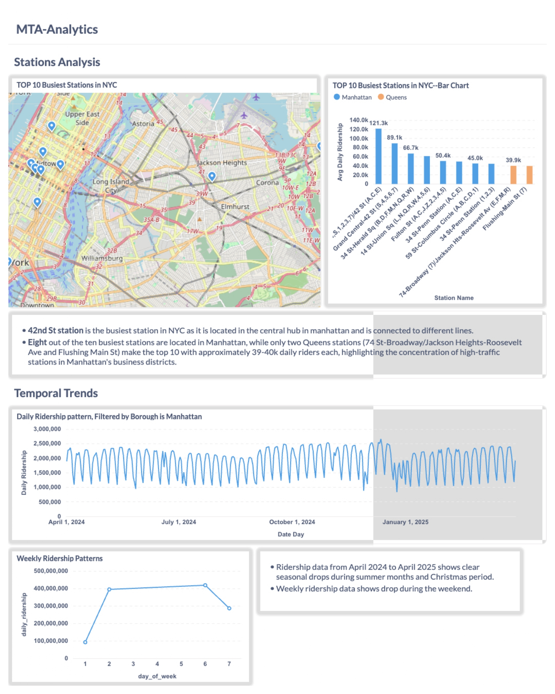
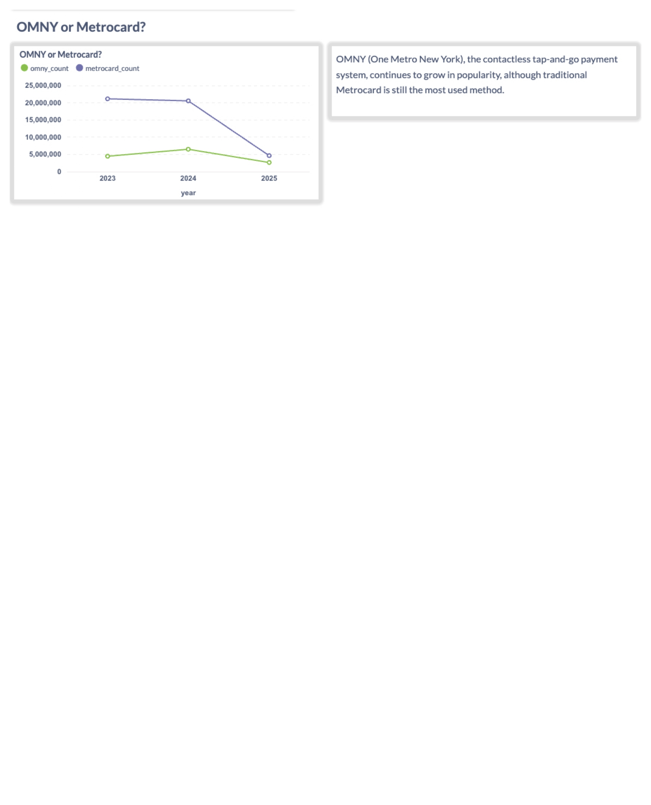

# MTA Subway Analytics Pipeline

## Problem Description
This project implements an end-to-end data pipeline that processes MTA subway ridership data to analyze passenger flow patterns across New York City's subway system. The pipeline ingests hourly ridership data from the MTA's open data portal, transforms it using modern data tools, and visualizes key insights through an interactive dashboard.


### Technology Stack
- **Cloud**: Google Cloud Platform (GCP)
- **Infrastructure as Code**: Terraform
- **Data Lake & Warehouse**: Google Cloud Storage → BigQuery
- **Batch Processing**: Python with Socrata API
- **Data Transformation**: dbt
- **Dashboard**: Metabase
- **Orchestration**: Make

## Data Pipeline

### Data Sources
1. MTA Subway Hourly Ridership (2020-2024)
   - Source: [data.ny.gov](https://data.ny.gov/Transportation/MTA-Subway-Hourly-Ridership-2020-2024/wujg-7c2s)
   - Date Range: 2020-01-01 to 2024-12-31
   - Update Frequency: Daily
   - Key metrics: ridership counts, station information, payment methods

2. MTA Subway Hourly Ridership (2025)
   - Source: [data.ny.gov](https://data.ny.gov/Transportation/MTA-Subway-Hourly-Ridership-Beginning-2025/5wq4-mkjj)
   - Date Range: 2025-01-01 to present
   - Update Frequency: Daily
   - Key metrics: ridership counts, station information, payment methods

### Batch Processing
The pipeline performs the following steps:
1. Ingests data from both MTA APIs using Python requests library
2. Processes data in monthly batches
3. Stores raw CSV files in GCS
4. Loads into BigQuery staging tables using bq_load.py
5. Transforms data using dbt models
6. Creates final analytics tables for dashboard consumption

### Data Warehouse
BigQuery tables are optimized for analytical queries:
- Partitioned by date for efficient temporal queries
- Clustered by station and borough for geographical analysis
- Indexed for common aggregation patterns

### Data Transformations
dbt models create the following layers:
- staging: Raw data cleaning and type casting
- intermediate: Core business logic and metrics
- mart: Final tables optimized for dashboard queries

## Getting Started

### Core Tool Installation

1. Install Terraform:
```bash
# MacOS with Homebrew
brew install terraform

# Ubuntu/Debian
sudo apt-get update && sudo apt-get install terraform

# Verify installation
terraform --version
```

2. Install dbt:
```bash
# Using pip
pip install dbt-core dbt-bigquery

# Verify installation
dbt --version
```

3. Install Make:
```bash
# MacOS with Homebrew
brew install make

# Ubuntu/Debian
sudo apt-get update && sudo apt-get install make

# Verify installation
make --version
```

### Project Setup

1. Clone the repository:
```bash
git clone https://github.com/yourusername/mta-subway-analytics.git
cd mta-subway-analytics
```

2. Set up Python environment and install dependencies:
```bash
python -m venv venv
source venv/bin/activate  # or `venv\Scripts\activate` on Windows
pip install -r requirements.txt
```

### Environment Configuration

1. Data Ingestion Setup (.env):
```bash
# Create .env file in data_ingestion/
# MTA Subway Data API Configuration
MTA_API_TOKEN=12iu3y1u2i3123123
MTA_API_BASE_URL=https://data.ny.gov/resource/wujg-7c2s.json

# GCP Configuration
GOOGLE_APPLICATION_CREDENTIALS=/path/to/your/gcp_credentials.json
GCP_PROJECT_ID=your_project_id
GCP_DATASET_ID=your_dataset_id
```

2. Terraform Setup (terraform.tfvars):
```bash
# Create terraform.tfvars in terraform/
project_id = "your-project-id"
region     = "US"
zone       = "us-central1-a"
credentials_file = "path/to/your/service-account-key.json"
```

### Running the Pipeline

1. Initialize and apply infrastructure:
```bash
make init-infra
make apply-infra
```

2. Run the complete pipeline:
```bash
make pipeline
```
This will execute:
- Data ingestion from MTA API
- Loading data into BigQuery
- Running dbt transformations

3. Individual pipeline steps:
```bash
# Ingest data from MTA API
make ingest

# Test ingestion with limited data
make ingest-test

# Load data into BigQuery
make load-bq

# Test BigQuery loading with single month
make load-bq-test

# Run dbt transformations
make transform

# Run dbt tests
make test
```

## Project Structure
```
mta-subway-analytics/
├── terraform/                 # Infrastructure as code
│   ├── main.tf
│   ├── variables.tf
│   └── terraform.tfvars      # Infrastructure configuration
├── data_ingestion/           # Data ingestion scripts
│   ├── mta_ingest.py         # MTA API data ingestion
│   ├── bq_load.py            # BigQuery data loading
│   └── .env                  # Ingestion configuration
├── dbt/                      # Data transformation models
├── dashboard/                # Metabase configurations
├── requirements.txt          # Python dependencies
├── Makefile                  # Build automation
└── README.md                 # Documentation
```

## Development

### Make Commands
- `make init-infra`: Initialize Terraform
- `make apply-infra`: Apply Terraform configuration
- `make ingest`: Run data ingestion from MTA API
- `make ingest-test`: Test data ingestion with limited data
- `make load-bq`: Load all data into BigQuery
- `make load-bq-test`: Test BigQuery loading with single month
- `make transform`: Run dbt transformations
- `make test`: Run dbt tests
- `make clean`: Clean up temporary files
- `make pipeline`: Run complete pipeline (ingest → load-bq → transform)
- `make all`: Run complete setup and pipeline (setup → pipeline)

### Running Tests
```bash
make test
```
This runs dbt tests to validate data quality and transformations.

## Dashboard Preview

### MTA Analytics Dashboard



