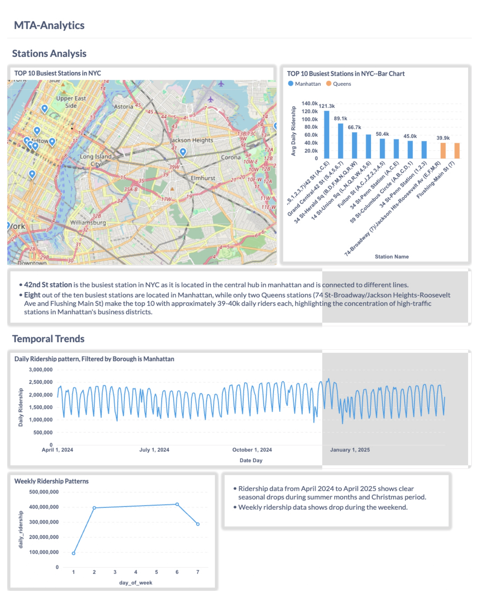
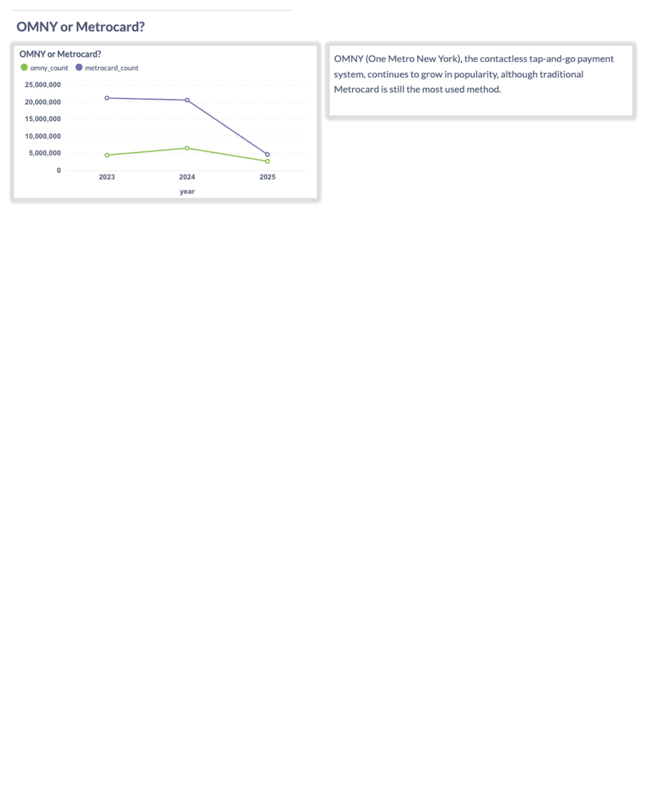

# MTA Subway Analytics Dashboard

## Overview
This dashboard provides comprehensive analytics for New York City's subway ridership patterns using Metabase visualizations. The analysis is based on MTA turnstile data, focusing on station performance, temporal trends, and payment methods.

## Dashboard Preview
### Page 1

### Page 2

## Dashboard Components

### 1. Station Performance
- **Top 10 Busiest Stations Bar Chart**
  - Visualizes the busiest subway stations by average daily ridership
  - Highlights Manhattan's dominance with 8 of 10 busiest stations
  - Shows significant ridership at major hubs like Union Square and Grand Central

### 2. Temporal Analysis
- **Weekly Ridership Patterns**
  - Displays ridership trends across different days of the week
  - Shows variations by borough
  - Highlights weekday vs weekend patterns

- **Monthly Ridership Trends**
  - Tracks ridership from April 2024 to April 2025
  - Shows clear seasonal drops during summer months and Christmas period
  - Helps identify peak usage periods

### 3. Payment Method Analysis
- **OMNY vs MetroCard Usage**
  - OMNY (One Metro New York), the contactless tap-and-go payment system, continues to grow in popularity
  - Tracks the transition in payment preferences
